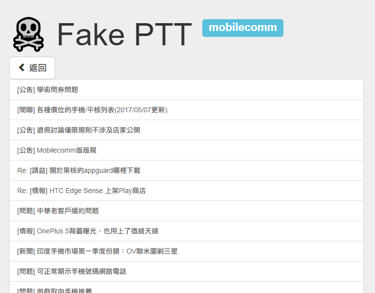

# ptt-viewer

An elegant local web-page interface for viewing and editing crawled data from PTT which stored in `json`.



## Requisite:
- Python 3
- Install requirements

    ```
    pip install -r requirements.txt
    ```

## Usage

1. Put all `json` files under `data/`
```
.
├── data/
│   ├── some1.json
│   ├── some2.json
│   └── ...
│
├── templates/
│   └── ...
└── app.py
```

2. Run the command
```
python app.py
```

3. Open `localhost:5000` in your browser

Then, you get a fake PTT :cloud:
